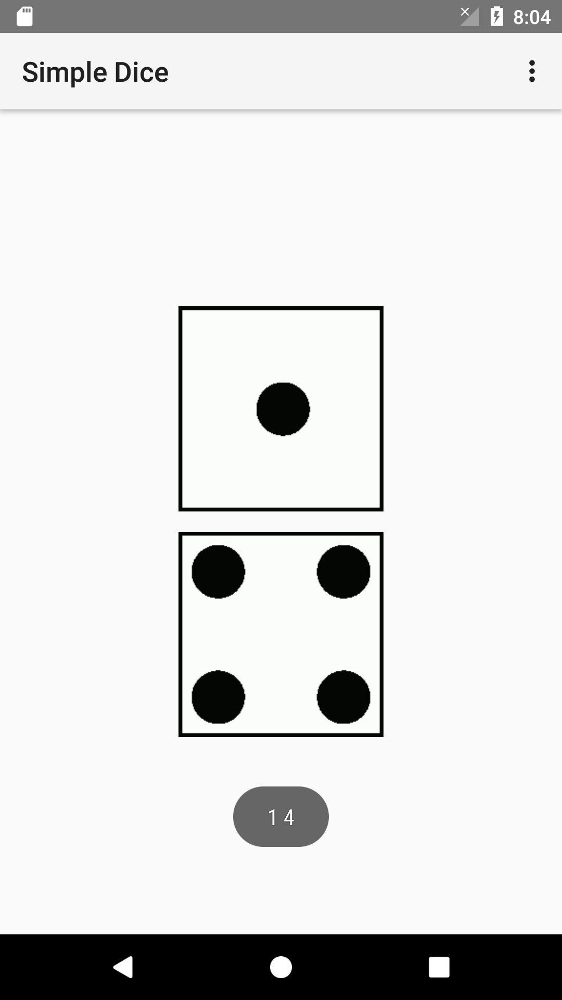

# Dice Game With Prediction

## Project Member
| No | Profile Picture | Member Name | Github Userid | Student Id Number |
| ------ | ------ | ------ | ------ | ------ |
| 1. |  |Bryan Christofel Yehezkiel | <a title="@bryanchr" href="https://github.com/bryanchr">@bryanchr</a> | 00000016528 | 
| 2. |  | Sudono Tanjung | <a title="@sudtanj" href="https://github.com/sudtanj">@sudtanj</a> |              				 00000012273 |

## Screenshot
### 0% correctness
#### Prediction and Result


### 50% correctness
#### Prediction


#### Result


### 100% correctness
#### Prediction and Result


## How to predict?
To do prediction in this app, this app use the following code that located in the simple-dice-with-prediction/app/src/main/java/com/example/user/dice_accel/RandomPredictor.java

```java
public class RandomPredictor {
    //used internally by Random to generate the next numbers
    private static final long multiplier = 0x5DEECE66DL;
    private static final long addend = 0xBL;
    private static final long mask = (1L << 48) - 1;

    //the seed. If we find the seed, we can predict the 'random' numbers
    private static Long seed;

    //the random number we will be busting
    private static Random random = new Random();

    //how many iterations did we need?
    private static int iterations = 1;

    public RandomPredictor(){
        findSeed(random.nextInt());
    }

    public int getPrediction(){
        predictNext(32);
        return predictNext(32);
    }

    protected static synchronized void findSeed(long v1) {
        long v2 = random.nextInt();
        for (int i = 0; i < 65536; i++) {
            seed = v1 * 65536 + i;
            if ((((seed * multiplier + addend) & mask) >>> 16) == v2) {
                System.out.println();
                System.out.println("Seed found: " + seed + " in " + iterations + " iterations");
                break;
            }
            seed = null;
        }

        //if we haven't found it yet, loop through again
        iterations++;
        if (seed == null) findSeed(v2);
    }
    
    protected static synchronized int predictNext(int bits) {
        seed = (seed * multiplier + addend) & mask;
        return (int) (seed >>> (48 - bits));
    }
}
```
## Random Distribution
The randomization of the dice is using the java built-in Random class. this apps called .nextInt() method to generate the outcome twice (two dices). According to the Java Random class documentation. it is said that method .nextInt() is uniformly distributed, sometimes also known as a rectangular distribution, which is a distribution that has constant probability.


## Reference 
- <a href="https://github.com/dylanmtaylor/Simple-Dice">dylanmtaylor/Simple-Dice</a> 
- <a href="https://www.codemagi.com/blog/post/247">Busting Java Random</a>
- <a href="https://en.wikipedia.org/wiki/Discrete_uniform_distribution">Discrete uniform distribution</a>

